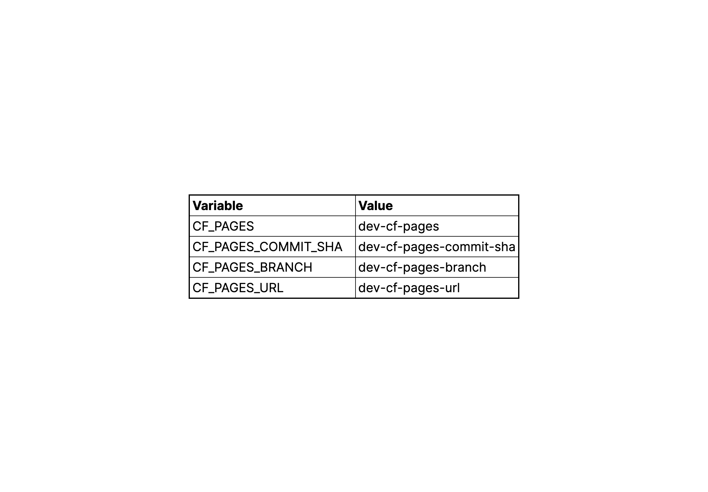
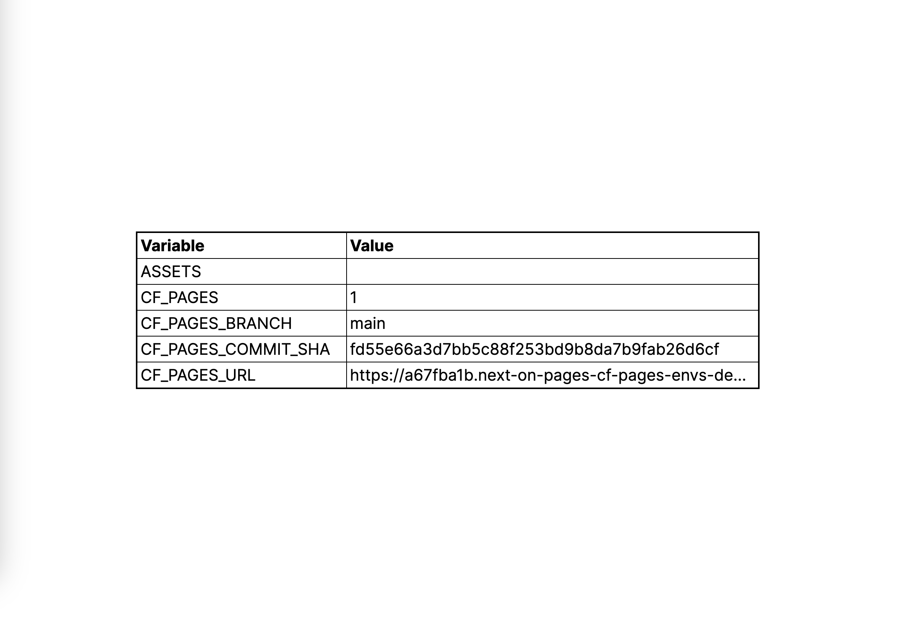

# `next-on-pages` CF_PAGES Environment Variables Demo

This very minimal demo shows how to access the [Cloudflare Pages injected environment variable](https://developers.cloudflare.com/pages/configuration/build-configuration/#environment-variables)
(i.e. `CF_PAGES`, `CF_PAGES_BRANCH`, `CF_PAGES_COMMIT_SHA` and `CF_PAGES_URL`) in next-on-pages applications.

For local development the variables are set in the `.dev.vars` file and by running the application locally `npm run dev` (after having
installed the dependencies with `npm i`) the following page should be served:

The deployed application (deployed via `npm run deploy`) should instead present something like the following:

